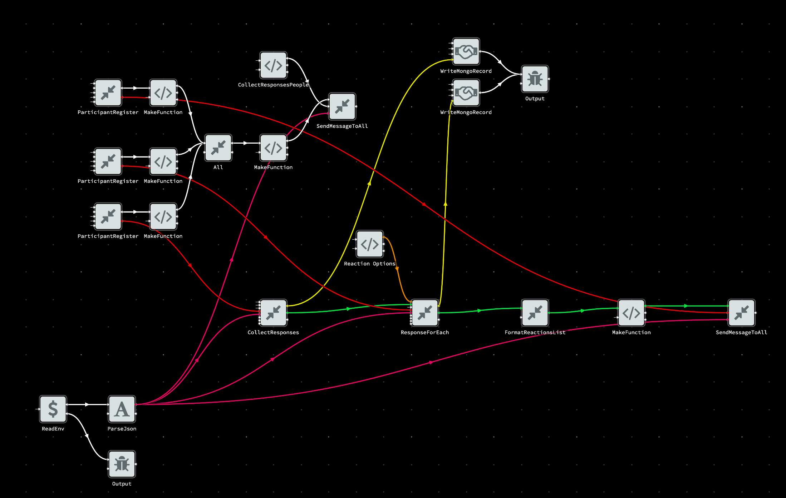
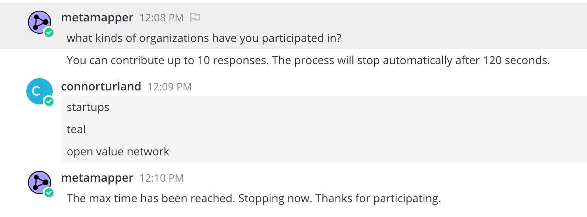
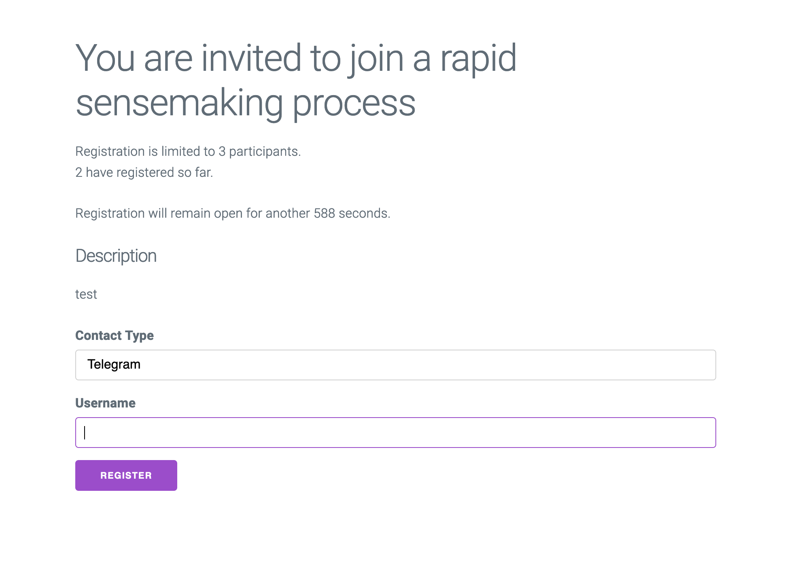

[](https://circleci.com/gh/rapid-sensemaking-framework/noflo-rsf)
[](https://opencollective.com/rapid-sensemaking-framework) 

# noflo-rsf

Welcome to the Rapid Sensemaking Framework ecosystem entry point!

- [Skip to `Using the CoSense App`](#using-the-cosense-app)
- [Skip to `Using Flowhub for Deep Design`](#using-flowhub-for-deep-design)
- [Skip to `Principles`](#principles)
- [Skip to `Related Projects`](#related-projects)
- [Skip to `RSF Components`](#rsf-components)
- [Skip to `RSF Contactables`](#rsf-contactables)


## What Is The "Rapid Sensemaking Framework"?

The rapid sensemaking framework is a set of tools designed to facilitate human conversation, ideation, reasoning, and decision taking at a large scale.

Common processes for gathering human expressions (be they ideas, questions, claims, votes, edits, etc) are encoded as pluggable open-source modules that can reach across the various digital devices and applications we commonly use.

Skilled facilitators and process designers can use the rapid sensemaking framework to conduct and unfold processes for ideation, discussion, evaluation, and decision making.

The basic tenets are
- ideation
- evaluation and ranking, sorting
- selection, voting, consenting

Apart from a few integrations, such as ones that Loomio has with Slack, other platforms with similar goals require participants to join a new platform, and familiarize with a new tool. The RSF assumes the opposite, and brings the conversation to an already familiar space to participants: a chat platform they're already using. The process designer can even specify different people as reachable on DIFFERENT platforms, and the process can still be conducted.


## Using the CoSense App

The CoSense app is currently at a functional prototype readiness level, and under development at the [rsf-electron](https://github.com/rapid-sensemaking-framework/rsf-electron) repository, where you can download and test a release of the [app for Mac](https://github.com/rapid-sensemaking-framework/rsf-electron/releases)!


## Using Flowhub for Deep Design

- Use flowhub to design a process... you can actually run it that way too.
- https://app.flowhub.io
- Check out [this section](https://github.com/rapid-sensemaking-framework/noflo-rapid-sensemaking-server#noflo--flowhub) for a guide on how to use Flowhub and RSF :)


## Principles

The tools should offer participants in processes as much transparency into the process as makes sense for the use case. In most cases, all the participants should have the results of the entire process, rather than constrict the results to the facilitator. The process should benefit everyone, and be non value extractive in its approach to working with data.

## Related Projects

Inspirations and related projects include the likes of
- [Kialo](https://www.kialo.com/)
    - tool to engage in thoughtful discussion, understand different points of view, and help with collaborative decision-making
- [Pol.is](https://pol.is/home)
    - helps organizations understand themselves by visualizing what their members think. Get a clear picture of all the points of view to help move a conversation forward.
- [Twitter Polls](https://help.twitter.com/en/using-twitter/twitter-polls)
- [Slido](https://www.sli.do)
    - Audience participation platform (corporate), Q&A and polling platform
- [Teeming](https://www.teeming.ai/)
- [Poll Everywhere](https://www.polleverywhere.com/)
- [Pulse Sense Evolve](https://pulsesenseevolve.com/)
- [Groupmap](https://www.groupmap.com/)
    - capturing individual thinking, revealing the group perspective, all in real-time. Collaborative decision making.
- [All Our Ideas](https://www.allourideas.org/)
    - start with a question and some seed ideas and create a "wiki survey". The best ideas bubble to the top.
- [Stormz](https://stormz.me)
    - enables you to design and facilitate collective intelligence sessions to test participant's knowledge, foster meaningful conversations, co-create solutions and make informed decisions.
- [Codigital](https://www.codigital.com/)
    - "Real-Time Ideas Engine". For large groups to generate, prioritize and refine ideas.
- [Loomio](https://www.loomio.org/)
    - helps people have discussions and make decisions together
    - Loomio includes some wonderful [help text explaining best practices](https://help.loomio.org/en/user_manual/getting_started/decision_tools/) for using the powerful tools in the decision/polling toolbox of Loomio.
- [Assembl](https://bluenove.com/en/offers/assembl/)
    - massive collective intelligence is the capacity to mobilize communities on a large scale (hundreds and thousands of participants) around key stakes and challenges to co-create new solutions in a short space of time
- [IdeaLoom](https://www.idealoom.org/)
    - sister project to Assembl
    - allows large communities to hold a meaningful conversation at scale, reach a common understanding, and develop solutions beyond what each participant could have envisioned
- [Decider.app](https://thedecider.app/)
    - Answer a few simple questions to explore better ways to make group decisions.
    - Related is https://www.parabol.co/blog/async-decision-making-slack

## RSF Components

Components are little modules of code. These operations can either be very quick, just performing a very simple transformation on data, requiring no human input, or they can involve lots of human input, and be medium to long running operations, meaning they could take days or weeks.

A component can do whatever it takes to ingest and coordinate this human input, which will very likely involve standing up web servers, and other connection/protocol variants.

At the time of writing, just a few components of interest have been developed, that are made to be plug and play with one another.
- [CollectResponses](https://github.com/rapid-sensemaking-framework/noflo-rsf/blob/master/ts-components/CollectResponses.ts)
    - for a prompt, collect statements numbering up to a given maximum (or unlimited) from a list of participants
    - 
- [ResponseForEach](https://github.com/rapid-sensemaking-framework/noflo-rsf/blob/master/ts-components/ResponseForEach.ts)
    - for a list/array of statements, collect a response or vote (from a limited number of valid options, or unlimited) for each from a list of participants
- [PairwiseComparison](https://github.com/rapid-sensemaking-framework/noflo-rsf/blob/master/ts-components/PairwiseComparison.ts)
    - input: a list of statements, process: have all participants choose preferences between pairs of statements, return the list of compared/ranked results.
- [PairwiseComparisonQual](https://github.com/rapid-sensemaking-framework/noflo-rsf/blob/master/ts-components/PairwiseComparisonQual.ts)
    - like PairwiseComparison, but allows for freeform response to the relationship between the two compared elements
- [PairwiseComparisonQuant](https://github.com/rapid-sensemaking-framework/noflo-rsf/blob/master/ts-components/PairwiseComparisonQuant.ts)
    - like PairwiseComparison, but allows for numerical quantified response to the relationship between the two compared elements
- [ParticipantRegister](https://github.com/rapid-sensemaking-framework/noflo-rsf/blob/master/ts-components/ParticipantRegister.ts)
    - input: nothing, process: spin up a form on a webserver and collect peoples contact info that opt in to participate, output: a list of Contactable participantConfigs
    - 
- [FormatReactionsList](https://github.com/rapid-sensemaking-framework/noflo-rsf/blob/master/ts-components/FormatReactionsList.ts)
    - input: reactions list (from ResponseForEach), output: a string containing a nice, simple, human-readable version of the results
- [FormatStatementList](https://github.com/rapid-sensemaking-framework/noflo-rsf/blob/master/ts-components/FormatStatementList.ts)
    - input: statement list, output: a string containing a nice, simple, human-readable version of the results
- [SendMessageToAll](https://github.com/rapid-sensemaking-framework/noflo-rsf/blob/master/ts-components/SendMessageToAll.ts)
    - Send a given string to a list of given people (by contactableConfigs). Useful in a wide array of circumstances.
- [SortPairwiseResults](https://github.com/rapid-sensemaking-framework/noflo-rsf/blob/master/ts-components/SortPairwiseResults.ts)
    - Take a list of `statements` and a list of votes from `PairwiseComparison` and sort the list by the votes.
    
Lots of other Components have already been considered for implementation, for example
- SortFullList
    - a 'social sort' algorithm
- DotVote
    - a classic dot vote process, where people have a designated number of 'dots' to distribute across a variety of options given
- PickFromFullList
    - select one, or a few, from a longer list

Other ideas:
- run results through analysis algorithms for useful stats
- publish results to spreadsheets
- publish results to api endpoint
- export results for CSV download

The idea is that each component should clearly define what properties or values it expects as input,
and what properties or values it returns as output, if its successful.

By doing so, RSF Components can build up as a library over time, and where outputs of one component match the inputs of another,
those components can be strung together into more complex sequences. They could start to be combined in many different orders and in many different ways. For example, the output of `CollectResponses` feeds nicely into the `statements` input of `ResponseForEach`.

## RSF Contactables

Contactables are at the heart of the Rapid Sensemaking Framework. They represent a way to open up bi-directional channels of communication between a "bot", and a human, represented in the most basic form of digital communication, strings of text.

A Contactable represents the idea that the Component can "hear" a person, and a person can "hear" a Component. Thus, the API for a Contactable is literally as simple in `node` as `.speak()`, `.listen()`. The full API will be defined soon.

Each Contactable will represent an ability to bi-directionally communicate with a human, via the same API, independent of what technology and protocol is carrying the communications.

Configurations for people will be given as arrays in `participantsConfig`, and the Components will carry out their operations, independent of what channels they are communicating via, thus enabling the full cross-platform cross-protocol solution.

A `personConfig` object will be at a minimum something like:
```json
{
    "type": "sms",
    "id": "+12223334444"
}
```
`"name"` is treated as an optional property

At the time of writing, Components that use Contactables include [PairwiseComparison](https://github.com/rapid-sensemaking-framework/noflo-rapid-sensemaking/blob/master/ts-components/PairwiseComparison.ts), [CollectResponses](https://github.com/rapid-sensemaking-framework/noflo-rapid-sensemaking/blob/master/ts-components/CollectResponses.ts) and [ResponseForEach](https://github.com/rapid-sensemaking-framework/noflo-rapid-sensemaking/blob/master/ts-components/ResponseForEach.ts).

There is a module that collect a `participantsConfig` array as an output, which can then be fed in to another module. That is [ParticipantRegister](https://github.com/rapid-sensemaking-framework/noflo-rapid-sensemaking/blob/master/ts-components/ParticipantRegister.ts).

### Implementations So Far

[rsf-contactable](https://github.com/rapid-sensemaking-framework/rsf-contactable) is the main source of information on implemented carrier types, but here is a short and simple list:

- [rsf-smsable](https://github.com/rapid-sensemaking-framework/rsf-smsable) implements a texting carrier, via the [Twilio](https://www.twilio.com/) APIs
    - the `type` to give as a `personConfig` JSON object is `phone` and the format of `id` must be like '+12223334444' (North American)
- [rsf-mattermostable](https://github.com/rapid-sensemaking-framework/rsf-mattermostable) implements a [Mattermost](https://mattermost.com/) carrier, via the Mattermost APIs
    - the `type` to give as a `personConfig` JSON object is `mattermost` and the format of `id` must be like 'username@https://mattermost-server.com'
- [rsf-telegramable](https://github.com/rapid-sensemaking-framework/rsf-telegramable) implements a [Telegram](https://telegram.org/) carrier, via the Telegram APIs
    - the `type` to give as a `personConfig` JSON object is `telegram` and the format of `id` must be like 'username'

Work In Progress
- [rsf-ssbable (secure scuttlebutt)](https://github.com/rapid-sensemaking-framework/rsf-ssbable)

Implementations under consideration:
- rsf-messenger (fb)
- rsf-emailable
- rsf-matrix
- rsf-twitter
- rsf-keybase

### Challenges

The biggest challenge so far encountered is rate limits on APIs. This constrains the number of messages that can be sent by a "bot" within a certain period of time, limited differently depending on the system. If the contactable implementation doesn't take that into account, some messages will be dropped, which breaks the viability of the system. It is important to research the rate limits of a given system and make sure that an implementation conforms to them.

### Contactable API Specification

Please write other Contactable carriers, simply conforming to this minimal API!
To get them fully implemented, please submit a PR to [rsf-contactable](https://github.com/rapid-sensemaking-framework/rsf-contactable).

#### `constructor(id, name)`

`id` : `string`, this value should represent the full information required to contact a person via the type of carrier it is over. For example, if `type` is `phone`, then `id` should be of the format `+12223334444`, but if `type` is `email` then `id` should be a valid email, e.g. `person@somesite.com`

`name` : `string`, optional, a name which can be used throughout the Components at times to address the person in a more congenial way, during communications with them, if appropriate.

#### `.speak(text: string): Promise<void>`
Send a string of text to the person represented by the given Contactable.

**Todo**
- [ ] update .speak API so that it returns a promise that resolves when confirmation that the message has successfully been sent and received occurs. this will allow finer control of flow important in modules.

#### `.listen(callback(text: string) => void): void`
Set a function which will be called any time that the person represented sends a string of text back to the Component.

#### `.stopListening(): void`
Calling this will prevent any and all callbacks passed to `listen` from firing again. Should be called as cleanup after use.


#### `.id` : `string`
The `id` of the person given to the `constructor` function.

#### `.name` : `string`
The `name` of the person given to the `constructor` function.


___

Valid noflo port datatypes are:
all, string, number, int, object, array, boolean, color, date, bang, function, buffer, stream

## Contributors

### Code Contributors

This project exists thanks to all the people who contribute. [[Contribute](CONTRIBUTING.md)].
<a href="https://github.com/rapid-sensemaking-framework/noflo-rsf/graphs/contributors"></a>

### Financial Contributors

Become a financial contributor and help us sustain our community. [[Contribute](https://opencollective.com/rapid-sensemaking-framework/contribute)]

#### Individuals

<a href="https://opencollective.com/rapid-sensemaking-framework"></a>

#### Organizations

Support this project with your organization. Your logo will show up here with a link to your website. [[Contribute](https://opencollective.com/rapid-sensemaking-framework/contribute)]

<a href="https://opencollective.com/rapid-sensemaking-framework/organization/0/website"></a>
<a href="https://opencollective.com/rapid-sensemaking-framework/organization/1/website"></a>
<a href="https://opencollective.com/rapid-sensemaking-framework/organization/2/website"></a>
<a href="https://opencollective.com/rapid-sensemaking-framework/organization/3/website"></a>
<a href="https://opencollective.com/rapid-sensemaking-framework/organization/4/website"></a>
<a href="https://opencollective.com/rapid-sensemaking-framework/organization/5/website"></a>
<a href="https://opencollective.com/rapid-sensemaking-framework/organization/6/website"></a>
<a href="https://opencollective.com/rapid-sensemaking-framework/organization/7/website"></a>
<a href="https://opencollective.com/rapid-sensemaking-framework/organization/8/website"></a>
<a href="https://opencollective.com/rapid-sensemaking-framework/organization/9/website"></a>
